# Coding standards and best practices for software development.

**Version:** 1.0
**Last updated:** 2026-02-08

---

## Typescript Coding Rules

### Strict mode
- No any — Never use the any type. Use unknown if type is truly unknown, then narrow it.
- No implicit any — All variables and parameters must have explicit types.
- Strict null checks — Handle null/undefined explicitly.
- No unused variables — Remove or prefix with underscore (_) if intentionally unused.

------

## Project Structure

### Monorepo structure
- `packages/` — Contains all packages (frontend, backend, shared).
- `docker/` — Docker-related files and configurations.
- `postman/` — Postman collections for API testing.
- `documents/` — Additional documentation (e.g., code rules, API docs).
- `apps/` — Optional directory for separate applications if needed.


### Backend structure
The API follows a layered architecture without a separate controller layer. Route handlers call services
and repositories directly.

- config
- lib
- plugins
- repos
- routes
- services
- types
- utils
- db.ts
- server.ts

PATH: `apps/api/src/`

### Frontend structure
Type Based:

- api
- components
- screens
- navigation
- stores
- services
- hooks
- types
- styles
- utils
- App.tsx


PATH: `apps/syncstation-app/src/`

---

## Naming Conventions

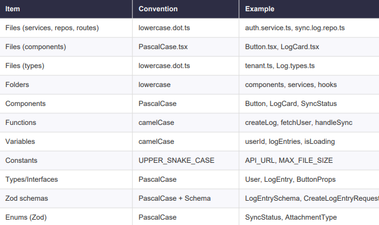

---

## Functions and exports

### Function declarations

Use regular function declarations for named/exported functions instead of arrow functions assigned to variables.

This promotes better readability and allows for easier debugging (e.g., clearer stack traces).

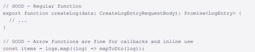

### Named exports only

Always use named exports. Avoid default exports to maintain consistency and improve code clarity.

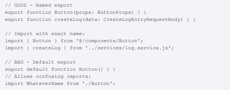

#### Why named exports?
- **IDE autocomplete** works better with named exports, providing more accurate suggestions.
- **Easier refactoring**: Renaming a named export will automatically update all imports.
- **Clearer imports**: Named exports make it clear what is being imported, improving readability.
- **Consistent style**: Using only named exports promotes a consistent code style across the codebase.

---

## Types and Interfaces

### Shared types in Schema Package

All API contracts (request/response shapes) live in packages/schema/src/ and are imported via
@hk26/schema. Do not duplicate types in app code.

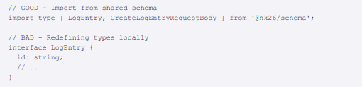

### App-Specific types

Types that only apply to one app go in that app's /types directory.

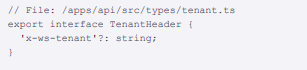

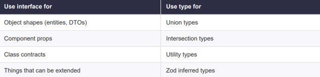

---

## Imports

### Import style

The repo uses relative imports with .js extensions for internal files (required by NodeNext/ESM) and
package aliases for cross-package imports:
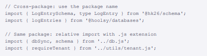

### Import order

Imports are organized in this order (ESLint enforces alphabetical within groups):

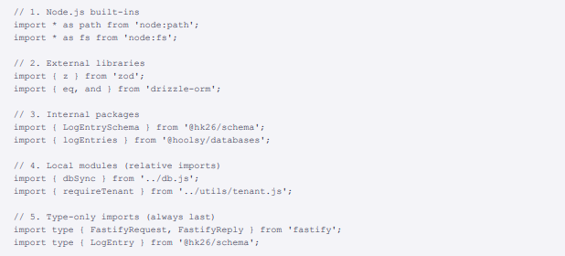

---

## Error Handling

### Standard API response format

All API responses use ok (not success) to indicate outcome:

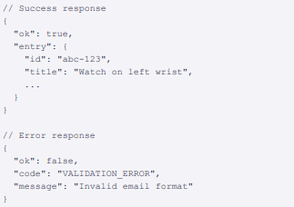

### Error codes

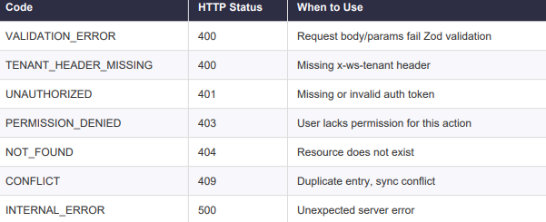

### Error helper

Use the err() utility for consistent error responses:

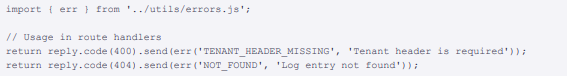

### Zod validation in routes

Fastify's Zod type provider handles validation automatically via the schema option. For manual validation,
use .parse():

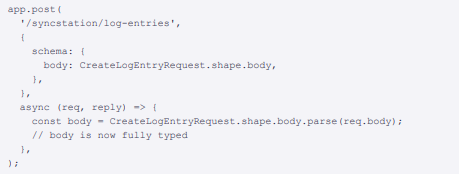

---

## Backend architecture

### Layer Responsibilities

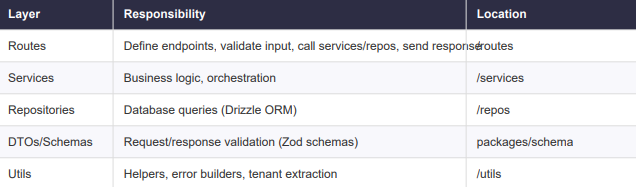

### Tenant isolation

Every endpoint that touches tenant-scoped data must:
- Extract tenant ID from x-ws-tenant header using requireTenant(req)
- Return 400 if missing
- Filter all DB queries by tenantId

### Atuhentication

JWT tokens are used for authentication. The authenticate decorator verifies the token, and
req.jwtVerify() extracts the user ID from the sub claim.


---

## Frontend architecture

### Component structure

Each component has its own folder with related files:
for example, a Button component would have:
```components/Button/
  Button.tsx
  Button.styles.ts
  Button.types.ts
  index.ts
```

### Screen structure

Each screen has its own folder under /screens with related components and styles.

HomeScreen example:
```screens/HomeScreen/
  HomeScreen.tsx
  HomeScreen.styles.ts
  HomeScreen.types.ts
  index.ts
```
LoginScreen example:
```screens/LoginScreen/
  LoginScreen.tsx
  LoginScreen.styles.ts
  LoginScreen.types.ts
  index.ts
```


---

## State management
Zustand is a lightweight state management library for React. It provides a simple way to create global
stores that components can subscribe to. Unlike Redux, it has minimal boilerplate and is easy to learn.

Reason for choosing Zustand:
- Simplicity: Zustand has a straightforward API with minimal setup, making it easy to integrate into a React project.
- Performance: Zustand uses a proxy-based approach that allows for efficient state updates without unnecessary re-renders.
- No providers needed: just import and use
- Typescript support: Zustand has built-in TypeScript support, making it easier to define and manage types for your state.
- Persist middelware: easy offline storage integration for things like auth tokens.

### Store per feature/domain
Each feature or domain should have its own store file under /stores.

For example:
```stores/
  authStore.ts
  userStore.ts
  settingsStore.ts
```


---

## Styling

### No inline styles

All styles should be defined in separate .styles.ts files using styled-components or a similar CSS-in-JS solution.
This promotes better separation of concerns and makes it easier to maintain and reuse styles across components.

### Shared styles
Common styles (e.g., colors, typography) should be defined in a shared styles file and imported where needed.

---

## Documentation requirements

### **Documentation is mandatory**.

Every feature must be documented before it is considered complete.
Document as you build — not after.

### **The rule**.

Document every endpoint, feature, and database change as part of the same commit or PR that
introduces the code.

Do not merge code without its corresponding documentation. Delayed
documentation is forgotten documentation.

### Documentation structure

```
/documents
  API.md                 # API endpoint documentation
  CodeRules.md           # Coding standards (this file)
  /guides                # Architecture docs and guides
  /hoolsy-platforms      # Hoolsy platform context (reference)
/postman
  HK26-API.postman_collection.json
  HK26-Local.postman_environment.json
README.md                # Quick start, links to docs
SETUP.md                 # How to run the project
```

### **What to document:**

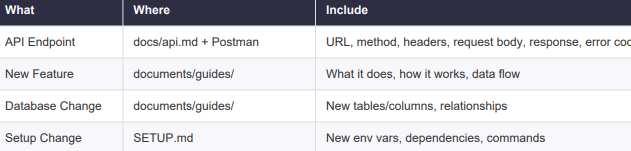

### Postman collections

- Every endpoint must have a corresponding Postman request
- Include example request body and headers
- Include test scripts that save variables (e.g., logEntryId, attachmentId)
- Update collection when API changes
- Commit updated collection to /postman/


---

## Git workflow

### Branching naming strategy

- feature/xxx for new features
- fix/xxx for bug fixes
- chore/xxx for non-feature work (e.g., documentation, refactoring)
- docs/xxx for documentation updates


- More to be added as needed

### Commit message format

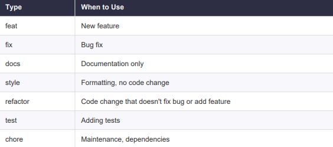

for example:
```
feat:
- Add create log entry endpoint
- Implement POST /syncstation/log-entries
- Add Zod schemas for request/response
- Update API documentation
```

### Commit Frequency

**Commit early and often**. Each logical unit of work should be its own commit. Do not accumulate a full day
of work into a single commit. A good rule of thumb: if you can describe what you did in one sentence, it
should be one commit.

**Good commit rhythm**:
- Finished a new service file → commit
- Added a new endpoint → commit
- Updated documentation for that endpoint → commit
- Fixed a bug you found while testing → commit

**Bad commit rhythm**:
- Built 3 endpoints, a service, updated docs, and fixed 2 bugs → one giant commit

**Pull Request Flow**:
1. Create branch from main: git checkout -b feature/my-feature
2. Make commits following conventional format
3. Push branch and create Pull Request
4. Request review from at least one team member
5. Address review comments
6. Squash and merge when approved


---

## Testing requirements

### Test runner: vitest

All tests use Vitest. Minimum 60% code coverage required for the project.

### Testing ground:

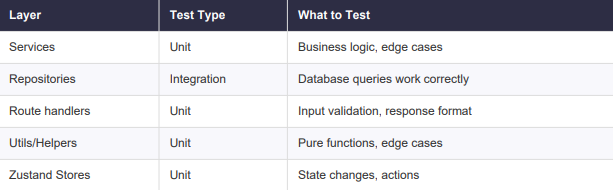

### For example:

**auth.service.ts → auth.service.test.ts**

**HomeScreen.tsx → HomeScreen.test.tsx**


---

## Code quality tools

### Eslint

ESLint is pre-configured in the repo with Airbnb-inspired rules. Key rules enforced:
- No any type (warning)
- No unused variables (warning, underscore prefix allowed)
- No console.log in production code (warning)
- Consistent type imports (import type { ... })
- Single quotes enforced
- Semicolons required
- 2-space indentation

### Prettier
Prettier is set up for automatic code formatting on save. It enforces consistent code style across the codebase, including:
- Line width of 80 characters
- Single quotes for strings
- Semicolons at the end of statements
- Amd much, much more.


- Prettier helps maintain a clean and uniform code style, improving readability and reducing formatting debates in code reviews.

**Important: The repo uses single quotes ('), not double quotes. This is enforced by both Prettier and
ESLint.**

### Running checks manually in terminal with:

Format all files:
```
pnpm format
```

Lint all files:
```
pnpm lint
```

Type check:
```
pnpm typecheck
```

Run tests:
```
pnpm test
```

Run tests with coverage:
```
pnpm test:coverage
```

---

